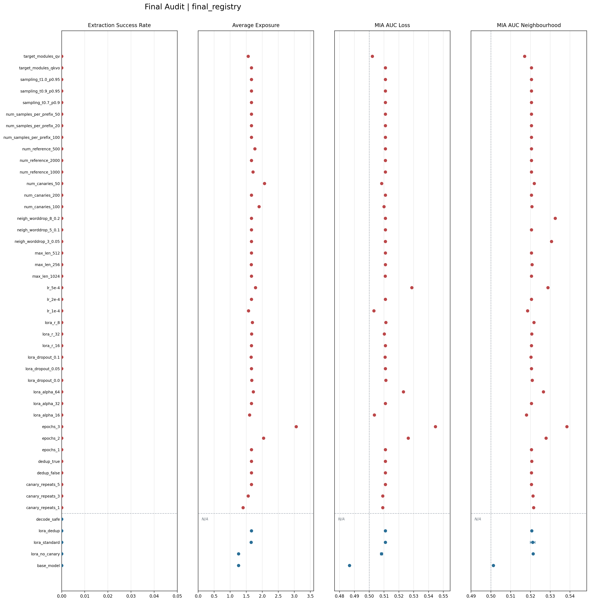
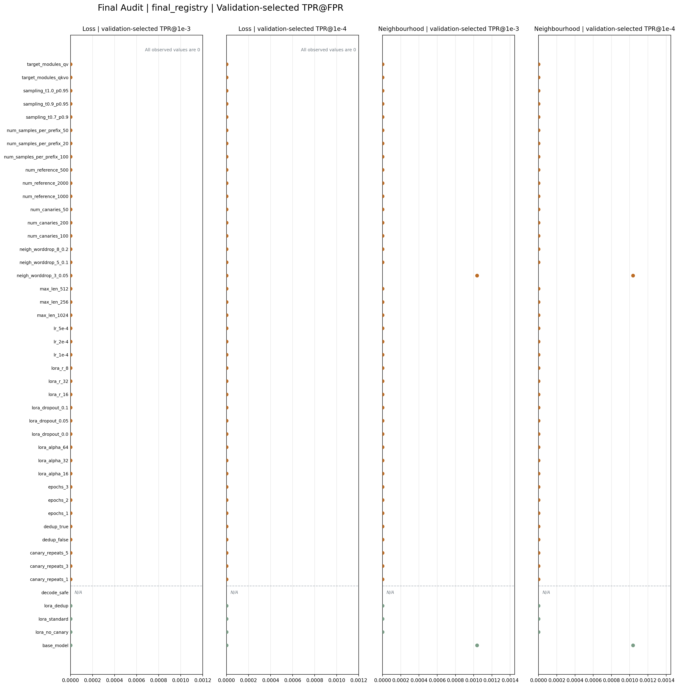

# LLM Privacy Audit

该项目复现并固化一个 **LLM 隐私审计闭环**。核心任务为：向训练语料中插入一组可追踪的虚构敏感字符串 `canary`，对 `Qwen2.5-0.5B-Instruct` 执行 **LoRA 微调**，再用 **canary 抽取攻击**、**approximate exposure** 和 **Membership Inference Attack, MIA** 三类方法判断模型是否出现记忆与泄露风险。

该项目可理解为一个面向大模型的 **泄露体检台**：先在训练数据里放入带标记的假敏感信息，再观察模型是否会直接背出、是否会在统计上更偏向记住这些内容、是否会暴露出成员样本特征。

## 1. 一页读懂

1. **准备数据**：修复原始 JSONL，构造成员集、非成员集，并向训练集插入 canary。
2. **训练模型**：对基础模型执行 LoRA 微调。
3. **执行审计**：分别测量直接抽取风险、统计暴露风险和成员推断风险。
4. **汇总结果**：生成逐运行明细、聚合总表、因子总表与图表。
5. **保留证据链**：每次运行都落盘到标准目录，便于复查和复跑。

## 2. 当前实验设置

| 项目 | 当前口径 |
| --- | --- |
| 基础模型 | `Qwen2.5-0.5B-Instruct` |
| 模型来源 | **ModelScope** |
| 训练方式 | **LoRA** 微调 |
| 成员原始输入 | `data/raw/repaired/train.jsonl`，1206 条 |
| 非成员输入 | `data/raw/repaired/nonmember.jsonl`，1193 条 |
| 标准训练集 | `data/processed/train_with_canary.jsonl`，2206 行 |
| 标准 canary 配置 | `num_canaries=200`，`canary_repeats=5` |
| 计算资源 | 单卡 **RTX 4090 24GB** |

`canary` 可理解为人为插入训练集的 **虚构敏感字符串**。当前模板包含 `NAME | EMAIL | PHONE | CODE` 四个字段，用于检查模型是否记住了特定内容。

## 3. 项目解决的痛点

- **缺少一条从数据构造、模型训练到隐私审计的完整闭环**
- **直接抽取失败时，风险容易被误判为不存在，缺少 exposure 与 MIA 这类补充信号**
- **不同训练参数与注入策略对风险的影响难以横向比较，缺少统一的实验矩阵和总表**
- **图表、方法说明、运行目录和结果汇总容易脱节，缺少可追溯的证据链**

## 4. 三类风险判断方法

当前项目使用三类方法判断模型是否出现记忆与泄露风险，三者关注的现象不同，适合配合阅读。

| 方法 | 关注点 | 实现方式 | 结果解读 |
| --- | --- | --- | --- |
| **canary 抽取攻击** | 模型是否会把训练集中插入的 canary 直接生成出来 | 向模型提供 canary 前缀，执行补全，统计是否命中完整 canary | 成功率越高，直接泄露证据越强；若结果为 `0`，只能说明当前设置下未直接抽取成功，不能单独推出没有风险 |
| **approximate exposure** | 模型是否在统计上更偏向记住目标 canary | 计算目标 canary 的负对数似然排名，并与一组随机参考 canary 对比 | 数值越高，说明目标 canary 越可能被模型特殊记住；该方法适合发现抽取攻击之外的隐含记忆信号 |
| **MIA** | 模型能否区分某条样本是否出现在训练集中 | 当前包含 `loss threshold` 与 `neighbourhood comparison` 两类 baseline 攻击 | 指标越高，说明成员样本与非成员样本越容易被区分，membership 风险越强 |

三类方法的侧重点如下：

- **canary 抽取攻击** 提供最直接的泄露证据。
- **exposure** 更适合发现直接抽取失败时仍然存在的统计记忆信号。
- **MIA** 更接近样本层面的训练成员身份泄露风险。

## 5. 术语解释

### 5.1 数据与样本相关术语

| 术语 | 含义 |
| --- | --- |
| `canary` | 人为插入训练集的虚构敏感字符串，用于检查模型是否记住特定内容 |
| `member` | 出现在训练集中的样本 |
| `nonmember` | 没有出现在训练集中的样本 |

### 5.2 风险指标相关术语

| 术语 | 含义 | 读数方式 |
| --- | --- | --- |
| `exposure` | 目标 canary 相对随机参考 canary 的记忆强度指标 | 数值越高，表示模型越偏向记住目标 canary |
| `avg_exposure` | 一组 canary 的 exposure 平均值 | 适合看整体趋势，不用于定位单条 canary |
| `MIA AUC` | MIA 的 ROC 曲线下面积 | `0.5` 附近表示接近随机猜测，越高表示 member 与 nonmember 越容易被区分 |
| `TPR` | 真阳性率，真实 `member` 被正确识别为 `member` 的比例 | 越高越好，表示攻击命中更多真实成员 |
| `FPR` | 假阳性率，真实 `nonmember` 被误判为 `member` 的比例 | 越低越好，表示误报更少 |
| `TPR@FPR` | 在固定误报率约束下的真阳性率 | 用于观察低误报条件下，攻击还能保留多少识别能力 |

### 5.3 联合词语

- 当 `Extraction Success Rate` 升高时，说明模型已经出现了更直接的内容泄露。
- 当抽取成功率仍为 `0`，但 `avg_exposure` 升高时，说明模型可能没有直接背出内容，但已经对目标字符串表现出更强记忆倾向。
- 当 `MIA AUC` 或 `TPR@FPR` 升高时，说明 member 与 nonmember 更容易被区分，训练成员身份泄露风险更强。
- 当 `FPR` 很低而 `TPR` 仍然不低时，说明攻击在严格控制误报的情况下仍然有效。

## 6. 结果总表

完整版见 [artifacts/reports/final_summary.md](./artifacts/reports/final_summary.md)。下表保留首页阅读最需要的核心 baseline。

| 实验组 | 含义 | seeds | 完整 canary 抽取成功率 | `avg_exposure` | `mia_auc_neighbourhood` | 首页解读 |
| --- | --- | --- | --- | --- | --- | --- |
| `base_model` | 基础模型，未做 LoRA | 1 | `0.000000` | `1.259471` | `0.501257` | 自然基线，MIA 接近随机猜测 |
| `lora_no_canary` | LoRA 微调，但训练集不插入 canary | 3 | `0.000000 ± 0.000000` | `1.261029 ± 0.008580` | `0.521339 ± 0.000056` | 微调本身带来轻微统计变化 |
| `lora_standard` | 标准 LoRA，训练集插入 canary | 3 | `0.000000 ± 0.000000` | `1.651849 ± 0.019638` | `0.521102 ± 0.001191` | `avg_exposure` 明显高于无 canary 设置 |
| `lora_dedup` | 训练前做精确字符串去重后再训练 | 1 | `0.000000` | `1.664285` | `0.520696` | 与标准 LoRA 接近，当前数据中的精确重复影响很小 |
| `decode_safe` | 推理阶段防护，仅改变生成输出 | 1 | `0.000000` | `-` | `-` | 可压住直接抽取，其他指标不作为该 baseline 的主口径 |

## 7. 图表解读

### 7.1 总图

`final_overview.png` 汇总了当前所有 baseline 和 aggregate label 的四项核心指标。



图中四个子图从左到右依次对应：

- `Extraction Success Rate`
- `Average Exposure`
- `MIA AUC Loss`
- `MIA AUC Neighbourhood`

读图时建议按以下顺序理解：

1. **先看直接抽取是否成功**。左侧第一列几乎全部贴近 `0`，说明在当前设置下，没有观察到完整 canary 被直接补全出来的证据。
2. **再看 exposure 是否抬升**。第二列区分度最高，是当前最有信息量的一列。
3. **最后看 MIA 是否同步增强**。第三列和第四列有变化，但整体仍停留在弱信号区间。

这张图传达的核心信息如下：

- **直接抽取信号弱**：`base_model`、`lora_no_canary`、`lora_standard`、`lora_dedup` 与 `decode_safe` 的完整 canary 抽取成功率均为 `0`。
- **统计记忆信号存在**：`lora_standard` 的 `avg_exposure = 1.651849 ± 0.019638`，明显高于 `lora_no_canary = 1.261029 ± 0.008580` 与 `base_model = 1.259471`。这说明即使没有直接背出完整 canary，模型对目标字符串的记忆倾向仍然增强。
- **dedup 影响较小**：`lora_dedup = 1.664285` 与 `lora_standard = 1.651849 ± 0.019638` 接近，说明当前数据中的精确重复不是主要风险来源。
- **训练强度影响更明显**：`epochs_3 = 3.055287`、`epochs_2 = 2.039426`、`lr_5e-4 = 1.786848` 均高于标准设置，说明更长训练和更激进学习率会放大记忆信号。
- **MIA 仍偏弱**：`lora_standard` 的 `mia_auc_loss = 0.510857 ± 0.000201`，`mia_auc_neighbourhood = 0.521102 ± 0.001191`。这些数值高于 `0.5`，但离强可分离状态仍有明显距离，因此更适合作为辅助证据。

用一句话概括总图：**当前实验中，直接抽取没有成功，主要风险信号来自 exposure；训练更久、学习率更高时，这一信号会更明显。**

### 7.2 低误报率 MIA 图

`mia_tpr_compare.png` 展示了在独立验证集上选阈后，四种低误报率条件下的 `TPR@FPR`。



图中四个子图从左到右依次对应：

- `Loss | validation-selected TPR@1e-3`
- `Loss | validation-selected TPR@1e-4`
- `Neighbourhood | validation-selected TPR@1e-3`
- `Neighbourhood | validation-selected TPR@1e-4`

这张图比总图更严格，因为它问的是：**在误报率被压得很低时，MIA 还能保留多少真实命中率。**

当前图像反映出的信息较清晰：

- **loss 分支几乎完全失效**：前两个子图中，已观测值全部为 `0`。这表示在当前验证集选阈口径下，loss-threshold MIA 在低 FPR 区间几乎没有可用识别能力。
- **neighbourhood 分支略有信号，但非常弱**：右侧两个子图大多数组别仍为 `0`，只有 `base_model` 与 `neigh_worddrop_3_0.05` 达到 `0.001036`，约为 `0.10%` 的 `TPR`，实际仍非常接近 `0`。
- **标准 LoRA 没有在低误报率下表现出稳定优势**：`lora_standard` 在四个子图里均为 `0`，说明当前 MIA 即使在 neighbourhood 分支中也没有给出强而稳定的低误报命中能力。
- **评估参数会影响图上高度**：`neigh_worddrop_3_0.05` 比默认 neighbourhood 设置更高，说明这里的一部分变化来自攻击器参数本身。

这张图对应的结论应保持克制：

- 当前 **MIA 的主要证据在于，总图中的 `AUC` 轻微抬升**。
- 在更接近实际审计场景的严格低误报条件下，当前 MIA 信号整体偏弱。
- 因此，当前阶段更稳妥的判断仍然是：**exposure 是主要风险信号，低 FPR MIA 只提供了有限补充。**

更详细的图表说明见 [artifacts/reports/final_plots/README.md](./artifacts/reports/final_plots/README.md)。

## 8. 如何理解这些结果

### 8.1 当前最稳妥的结论

- **直接抽取信号弱**：正式 baseline 与当前 ablation 中，完整 canary 抽取成功率均为 `0`。
- **统计记忆信号存在**：`lora_standard` 的 `avg_exposure` 为 `1.651849 ± 0.019638`，明显高于 `lora_no_canary` 的 `1.261029 ± 0.008580` 与 `base_model` 的 `1.259471`。
- **MIA 信号整体偏弱**：多数 `MIA AUC` 位于 `0.50` 到 `0.54` 区间，低误报阈值下的 `TPR@FPR=1e-3` 多数接近 `0`。
- **训练强度影响最明显**：`epochs=1 -> 2 -> 3` 时，`avg_exposure` 从 `1.660983` 升至 `2.039426`、`3.055287`，`mia_auc_neighbourhood` 也从 `0.520517` 升至 `0.527887`、`0.538428`。

### 8.2 指标怎么读

- `Extraction Success Rate`：能否直接生成完整 canary。数值越高，直接泄露风险越高。
- `avg_exposure`：目标 canary 在随机参考 canary 中越靠前，数值越高，说明模型越偏向记住该字符串。
- `MIA AUC`：member 与 nonmember 的可分离程度。`0.5` 附近表示信号较弱，越高表示 membership 风险越强。
- `TPR@FPR`：在限制误报率的前提下，真实命中率还能保留多少。该项目更关注低 FPR 区间。

### 8.3 消融实验给出的主要趋势

- `canary_repeats=1 -> 3 -> 5` 时，`avg_exposure` 为 `1.399037 -> 1.561922 -> 1.660983`，重复次数越高，统计记忆信号越强。
- `lr=1e-4 -> 2e-4 -> 5e-4` 时，`avg_exposure` 为 `1.570356 -> 1.660983 -> 1.786848`，较高学习率对应更强风险信号。
- `num_canaries=50 -> 100 -> 200` 时，`avg_exposure` 为 `2.069533 -> 1.900846 -> 1.660983`。当前设置下，较少的 canary 数量对应更高 exposure，具体原因仍需结合模板和数据规模解释。
- `max_len`、`lora_dropout`、`dedup` 在当前数据规模与模型大小下影响较小。
- 多数 ablation 仍为 **单次运行结果**，当前作用为趋势定位与敏感性审计。

## 9. 可视化与详细文档

- 图表说明：[artifacts/reports/final_plots/README.md](./artifacts/reports/final_plots/README.md)
- 最终审计报告：[artifacts/reports/final_audit_report.md](./artifacts/reports/final_audit_report.md)
- 方法说明：[artifacts/reports/method_notes.md](./artifacts/reports/method_notes.md)
- 聚合总表：[artifacts/reports/final_summary.md](./artifacts/reports/final_summary.md)
- 因子总表：[artifacts/reports/final_factor_summary.md](./artifacts/reports/final_factor_summary.md)
- 实验矩阵：[docs/experiment_matrix.md](./docs/experiment_matrix.md)

## 10. 快速复跑

### 10.1 安装依赖与环境自检

当前 `requirements.txt` 默认复用已有 `torch` 环境。

```bash
python -m pip install -r requirements.txt
python -m src.env_check
```

### 10.2 下载基础模型

```bash
python -m src.download_model \
  --model_id Qwen/Qwen2.5-0.5B-Instruct \
  --local_dir models/Qwen2.5-0.5B-Instruct
```

### 10.3 运行全流程

```bash
chmod +x run_full_pipeline.sh
./run_full_pipeline.sh
```

### 10.4 仅对已有 LoRA 结果执行审计

```bash
chmod +x run_all.sh
LORA_DIR=outputs/experiments/train/<run_id> ./run_all.sh
```

### 10.5 补齐 baseline 与 ablation

```bash
chmod +x run_completion_suite.sh
./run_completion_suite.sh
```

### 10.6 重新生成总表和总图

```bash
chmod +x run_final_report.sh
./run_final_report.sh
```

## 11. 目录结构

| 路径 | 作用 |
| --- | --- |
| `src/` | 数据处理、训练、攻击、汇总与可视化脚本 |
| `configs/` | 训练配置、实验配置、实验 registry |
| `data/` | 原始数据、修复数据、处理后数据与 canary 元数据 |
| `outputs/experiments/` | 每次实验的训练、攻击、exposure、MIA 与单运行图表 |
| `artifacts/reports/` | 汇总报告、总表、因子表与最终图表 |
| `docs/` | 环境、依赖、实验矩阵与进度记录 |
| `tests/` | 指标、配置、数据处理与流程测试 |

标准输出目录约定为 `outputs/experiments/<stage>/<run_id>/`。当前项目的核心价值在于 **审计流程可复跑**、**结果可追溯**、**图表与方法口径一致**。
