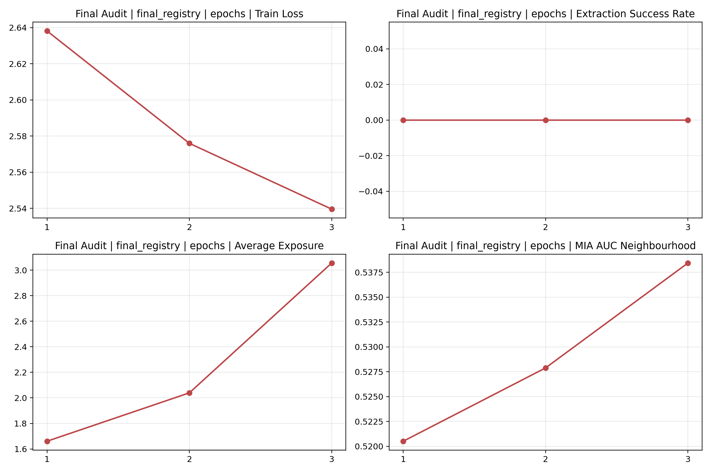
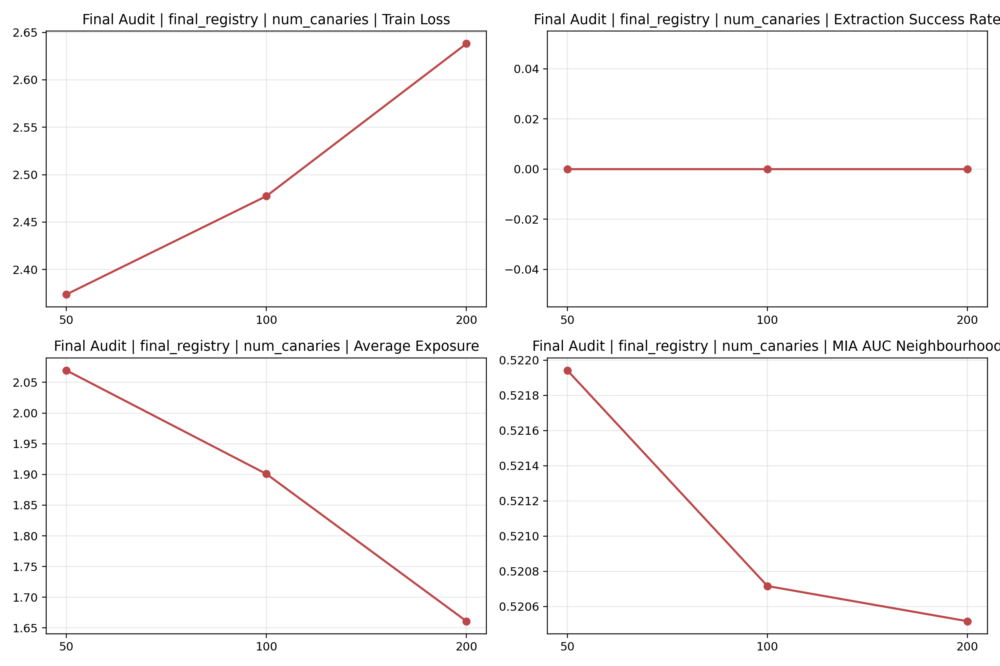
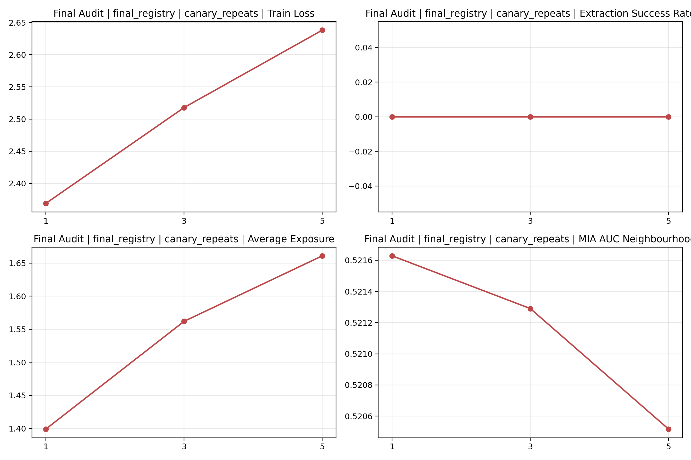
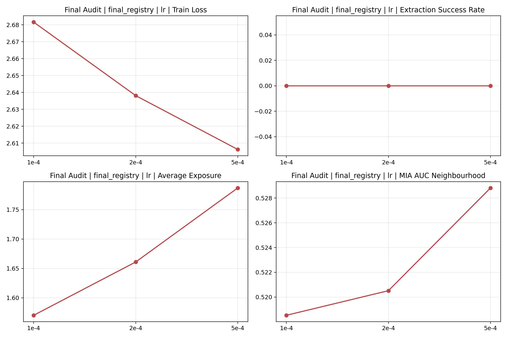

# 图表说明

该目录保存由 `configs/final_registry.yaml` 聚合生成的 **总图**、**低误报率对比图** 和 **消融图**。生成入口为 `./run_final_report.sh`，对应脚本为 `src/build_final_report.py`。

## 1. 目录内容

| 文件 | 作用 |
| --- | --- |
| `final_overview.png` | 所有 aggregate label 的四项核心指标总览 |
| `mia_tpr_compare.png` | 基于独立验证集选阈后的 `TPR@FPR` 对比 |
| `ablations/*.png` | 单个因子的趋势图 |
| `group_metrics.csv` | 总图对应数值 |
| `factor_metrics.csv` | 因子汇总数值 |
| `ablations/factor_metrics.csv` | 消融图所用数值备份 |

## 2. 阅读原则

- **baseline** 中的 `lora_standard` 与 `lora_no_canary` 为多 seed 汇总，误差线可直接表示波动范围。
- 多数 **ablation** 仍为单次运行结果，图中趋势适合用于敏感性定位，不直接表述为稳定统计规律。
- `Extraction Success Rate`、`avg_exposure`、`MIA AUC` 数值越高，表示风险信号越强。
- `MIA AUC` 接近 `0.5` 时，member 与 nonmember 的可分离性较弱。
- `TPR@FPR` 图重点观察低误报区间，适合判断实际审计时是否存在可用信号。

## 3. 总图

该图用于快速横向比较所有 baseline 与 aggregate label。当前版本采用 **四列横向排布的点图**，四个子图从左到右依次对应：

- `Extraction Success Rate`
- `Average Exposure`
- `MIA AUC Loss`
- `MIA AUC Neighbourhood`

纵轴为全部 `aggregate_label`，第一列显示完整标签，其余三列共享同一组标签。图中的虚线将 **baseline** 与 **ablation** 分开；误差线只会出现在多 seed 汇总组别上；`N/A` 表示该指标在该组别下不适用。

### 3.1 总图阅读顺序

纵轴标签较多，逐个读点位效率较低。更合适的顺序如下：

1. 先看 **第一列**，确认是否出现直接抽取。
2. 再看 **第二列**，判断统计记忆信号是否显著抬升。
3. 再看 **第三列** 与 **第四列**，判断 membership 信号是否同步增强。
4. 最后只比较少数关键标签，无需逐一扫描全部组别。

优先比较的标签为：

- `base_model` 与 `lora_no_canary`
- `lora_no_canary` 与 `lora_standard`
- `lora_standard` 与 `lora_dedup`
- `epochs_1`、`epochs_2`、`epochs_3`
- `num_canaries_50`、`num_canaries_100`、`num_canaries_200`

### 3.2 一眼可得的结论

- **第一列的点位几乎全部贴近 0**，说明当前设置下没有直接抽取出完整 canary。
- **第二列的横向差异最大**，说明当前最强的风险信号来自 `avg_exposure`。
- **第三列和第四列存在变化，但整体仍接近弱信号区间**，MIA 可作为辅助证据，当前不宜单独承担主结论。
- **最靠右的点位主要集中在 `epochs`、`num_canaries`、`lr` 等组别**，训练强度和注入策略比当前抽样参数更值得重点关注。

### 3.3 第一列：`Extraction Success Rate`

- 主要 baseline 均为 `0`：
  - `base_model = 0`
  - `lora_no_canary = 0`
  - `lora_standard = 0`
  - `lora_dedup = 0`
- `decode_safe = 0`
- 多数 ablation 也保持 `0`。
- 该子图的作用主要是给出一个明确边界：**当前没有直接背出完整 canary 的证据**。
- 因此读图重点不应停留在第一列，而应转向第二列到第四列。

### 3.4 第二列：`Average Exposure`

- 该子图区分度最高，是总图中最核心的风险信号。
- baseline 对比最清晰：
  - `base_model = 1.259471`
  - `lora_no_canary = 1.261029 ± 0.008580`
  - `lora_standard = 1.651849 ± 0.019638`
  - `lora_dedup = 1.664285`
- 这一组对比说明：
  - **仅做 LoRA 微调**，相对基础模型的 exposure 变化很小。
  - **插入 canary 后再微调**，exposure 明显抬升。
  - **dedup 与标准 LoRA 接近**，当前数据中的精确重复不是主要影响因素。
- 总图中 exposure 最高的几组为：
  - `epochs_3 = 3.055287`
  - `num_canaries_50 = 2.069533`
  - `epochs_2 = 2.039426`
  - `num_canaries_100 = 1.900846`
  - `lr_5e-4 = 1.786848`
- 第二列想传达的信息很直接：**统计记忆信号确实存在，而且会被训练强度进一步放大**。

### 3.5 第三列：`MIA AUC Loss`

- baseline 数值整体靠近 `0.5`：
  - `base_model = 0.486637`
  - `lora_no_canary = 0.508279 ± 0.000815`
  - `lora_standard = 0.510857 ± 0.000201`
  - `lora_dedup = 0.510951`
- 该子图说明：
  - loss-based MIA 能观察到一些变化，但幅度较小。
  - `lora_standard` 相比 `lora_no_canary` 仅轻微升高，当前证据强度有限。
- 较高的几组为：
  - `epochs_3 = 0.544670`
  - `lr_5e-4 = 0.528695`
  - `epochs_2 = 0.526347`
  - `lora_alpha_64 = 0.523077`
- 第三列更适合作为辅助验证：当训练更强时，membership 风险会随之抬头，但幅度仍明显弱于 exposure。

### 3.6 第四列：`MIA AUC Neighbourhood`

- 该子图比第三列更敏感，但仍需谨慎解读。
- baseline 组别为：
  - `base_model = 0.501257`
  - `lora_no_canary = 0.521339 ± 0.000056`
  - `lora_standard = 0.521102 ± 0.001191`
  - `lora_dedup = 0.520696`
- baseline 之间差距仍然不大，因此当前不应将其视为强 membership 泄露证据。
- 较高的几组为：
  - `epochs_3 = 0.538428`
  - `neigh_worddrop_8_0.2 = 0.532512`
  - `neigh_worddrop_3_0.05 = 0.530617`
  - `lr_5e-4 = 0.528812`
- 其中需要区分两类变化：
  - `epochs_3`、`lr_5e-4` 代表 **训练设置变化** 后风险指标更高。
  - `neigh_worddrop_*` 代表 **MIA 评估参数变化** 后攻击器更敏感，不等同于模型本身一定更危险。

### 3.7 总图中的三类标签

总图中的点位并不都表示同一种变化，主要分为三类：

- **baseline**
  - `base_model`
  - `lora_no_canary`
  - `lora_standard`
  - `lora_dedup`
  - `decode_safe`
- **训练级消融**
  - `epochs_*`
  - `lr_*`
  - `lora_r_*`
  - `lora_alpha_*`
  - `lora_dropout_*`
  - `num_canaries_*`
  - `canary_repeats_*`
  - `target_modules_*`
  - `dedup_*`
- **评估级消融**
  - `num_samples_per_prefix_*`
  - `sampling_*`
  - `num_reference_*`
  - `neigh_worddrop_*`

读取总图时，**baseline** 与 **训练级消融** 更适合用于判断模型风险变化；**评估级消融** 更适合用于判断攻击器本身是否更敏感。

### 3.8 总图想传达的核心信息

- **结论 1**：当前没有发现完整 canary 的直接抽取成功。
- **结论 2**：风险信号主要体现在 exposure，而不是抽取成功率。
- **结论 3**：`lora_standard` 相比 `lora_no_canary` 的 exposure 明显更高，说明 canary 注入改变了记忆表现。
- **结论 4**：更长训练和更高学习率会同步推高 exposure 与 MIA 指标，是当前最需要警惕的训练因素。
- **结论 5**：MIA 仍然偏弱信号，当前不宜将其单独作为最强结论来源。

### 3.9 使用总图时的注意事项

- `decode_safe` 仅作用于生成输出，因此在总图中更适合看第一列，其他子图出现 `N/A` 属于正常现象。
- `lora_standard` 与 `lora_no_canary` 带误差线，因为它们是多 seed 汇总；多数 ablation 没有误差线，因为当前只有单次运行。
- 总图适合做 **全局定位**，具体数值仍应回看 `group_metrics.csv` 或 `final_summary.md`。
- 若只保留一句话概括总图，可写为：
  - **当前实验中，直接抽取未成功，主要风险信号来自 exposure；训练更久、学习率更高时，这一信号会更明显。**

## 4. 低误报率 MIA 图

该图展示基于独立验证集选阈后的四类 `TPR@FPR` 指标。当前版本同样采用 **四列横向排布的点图**，四个子图从左到右分别对应：

- `Loss | validation-selected TPR@1e-3`
- `Loss | validation-selected TPR@1e-4`
- `Neighbourhood | validation-selected TPR@1e-3`
- `Neighbourhood | validation-selected TPR@1e-4`

其中：

- 第一列显示完整 `aggregate_label`，其余三列共享同一组纵轴标签。
- `N/A` 表示该组别在该指标下没有可用值。
- `All observed values are 0` 表示该列中所有已观测值都为 `0`，图里不再用几乎贴在原点上的点位硬挤出差异。

当前图像反映出的信息较直接：

- **前两列对应的 loss 分支几乎没有低 FPR 识别能力**，因此图中会直接标出 `All observed values are 0`。
- **后两列对应的 neighbourhood 分支略有信号，但整体仍然很弱**，多数点位依然贴近 `0`。
- **第一列到第四列都应优先看 baseline 与少数关键 ablation**，不需要逐一扫描全部标签。

## 5. 关键消融图

### 5.1 `epochs`

`epochs` 是当前最强的训练级风险因子。随着训练轮数从 `1` 增加到 `3`，`avg_exposure` 与 `mia_auc_neighbourhood` 同步抬升，说明更长时间的拟合更容易强化记忆信号。

### 5.2 `num_canaries`

当前单次运行结果中，`num_canaries=50 -> 100 -> 200` 时，`avg_exposure` 呈下降趋势。该现象表明在当前模板与数据规模下，较少的 canary 数量对应更高的统计暴露值。该结论仍需结合更多 seed 进一步确认。

### 5.3 `canary_repeats`

`canary_repeats=1 -> 3 -> 5` 时，`avg_exposure` 持续升高。该趋势说明同一 canary 在训练集中重复出现次数越多，模型越容易记住它。

### 5.4 `lr`

学习率升高时，`avg_exposure` 与 `MIA AUC` 也有上扬趋势。当前设置下，`lr=5e-4` 比 `1e-4` 和 `2e-4` 显示出更强的风险信号。

## 6. 使用边界

- 当前 exposure 口径为 **approximate exposure based on full-canary NLL ranking**。
- `decode_safe` 只作用于推理输出，不改变训练参数，因此在总图中的重点是直接抽取指标。
- 消融图中的很多组别为 **单次运行结果**。
- 完整方法说明见 [../method_notes.md](../method_notes.md)。
- 完整结果解释见 [../final_audit_report.md](../final_audit_report.md)。
